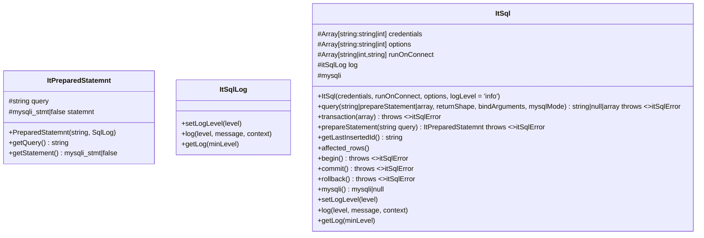

## DD?
	- DDL (Data Definition language): Alter, Create, Drop, ...
	- DCL (Data Control Language): Grant, Revoke, ...
	- TCL (Transaction Control Language): Begin, Commit, Rollback, SavePoint, ...
	- DML (Data Modification Language): Insert, Update, Delete, Truncate, Replace, ...
	- DQL (Data Query Language); Select



```


https://dev.to/surgbc/using-github-and-mermaidjs-to-document-software-architecture-using-c4-model-57fn?ref=lukemerrett.com

	classDef borderless stroke-width:0px
	classDef darkBlue fill:#00008B, color:#fff
	classDef brightBlue fill:#6082B6, color:#fff
	classDef gray fill:#62524F, color:#fff
	classDef gray2 fill:#4F625B, color:#fff

	subgraph Legend[Legend]
		Legend1[person]
		Legend2[system]
		Legend3[external person]
		Legend4[external system]
	end
	class Legend1 darkBlue
	class Legend2 brightBlue
	class Legend3 gray
	class Legend4 gray2
id1>"This is the text in the box"]
eight RFC 5424 levels (debug, info, notice, warning, error, critical, alert, emergency).

@startuml
interface Movable {
    + move()
}

class Car <|.. Movable
@enduml
[Child Class Name] -|> [Parent Class Name]
@startuml
abstract class Animal {
    + {abstract} eat()
}

class Dog -|> Animal
@enduml

```